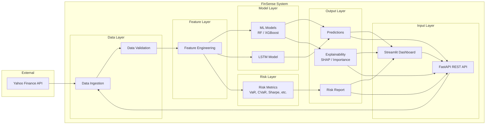
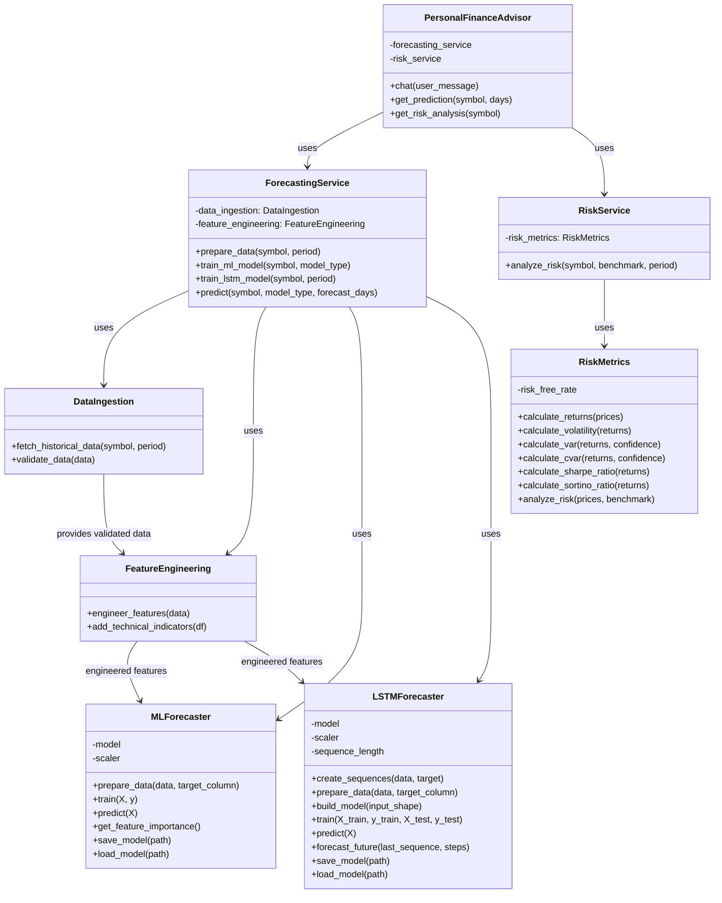

# FinSense: Hybrid Artificial Intelligence System for Financial Intelligence

---

## Table of Contents

| Chapter No. | Contents | Page No. |
|-------------|----------|-----------|
| | **Abstract** *(Capitalize Each Word, Bold)* | i |
| 1. | **INTRODUCTION** *(Uppercase, Bold)* | 1 |
| | 1.1 BACKGROUND | 1 |
| | 1.2 MOTIVATIONS | 2 |
| | 1.3 SCOPE OF THE PROJECT | 3 |
| 2. | **PROJECT DESCRIPTION AND GOALS** | 5 |
| | 2.1 LITERATURE REVIEW | 5 |
| | &nbsp;&nbsp;&nbsp;&nbsp;2.1.1 Machine Learning Based | 5 |
| | 2.2 GAPS IDENTIFIED | 6 |
| | 2.3 OBJECTIVES | 6 |
| | 2.4 PROBLEM STATEMENT | 7 |
| | 2.5 PROJECT PLAN | 7 |
| 3. | **TECHNICAL SPECIFICATION** | 9 |
| | 3.1 REQUIREMENTS | 9 |
| | &nbsp;&nbsp;&nbsp;&nbsp;3.1.1 Functional | 9 |
| | &nbsp;&nbsp;&nbsp;&nbsp;3.1.2 Non-Functional | 10 |
| | 3.2 FEASIBILITY STUDY | 10 |
| | &nbsp;&nbsp;&nbsp;&nbsp;3.2.1 Technical Feasibility | 10 |
| | &nbsp;&nbsp;&nbsp;&nbsp;3.2.2 Economic Feasibility | 11 |
| | &nbsp;&nbsp;&nbsp;&nbsp;3.2.3 Social Feasibility | 11 |
| | 3.3 SYSTEM SPECIFICATION | 11 |
| | &nbsp;&nbsp;&nbsp;&nbsp;3.3.1 Hardware Specification | 11 |
| | &nbsp;&nbsp;&nbsp;&nbsp;3.3.2 Software Specification | 12 |
| 4. | **DESIGN APPROACH AND DETAILS** | 13 |
| | 4.1 SYSTEM ARCHITECTURE | 13 |
| | 4.2 DESIGN | 14 |
| | &nbsp;&nbsp;&nbsp;&nbsp;4.2.1 Data Flow Diagram | 14 |
| | &nbsp;&nbsp;&nbsp;&nbsp;4.2.2 Class Diagram | 15 |
| 5. | **METHODOLOGY AND TESTING** | 17 |
| | &lt;&lt; Module Description &gt;&gt; | 17 |
| | &lt;&lt; Testing &gt;&gt; | 18 |
| | **REFERENCES** | 19 |

---

## **Abstract** *(Capitalize Each Word, Bold)*

**FinSense Is A Production-Ready Hybrid Artificial Intelligence System That Combines Machine Learning, Deep Learning, And Retrieval-Augmented Generation For Financial Market Analysis, Stock Price Forecasting, And Risk Assessment. The System Integrates Random Forest And XGBoost For Regression-Based Price Prediction, Long Short-Term Memory Networks For Time Series Forecasting, Comprehensive Risk Metrics Including Value At Risk And Conditional Value At Risk, And An Explainable Personal Finance Advisor Chatbot. This Document Describes The Background, Motivation, Scope, Technical Specifications, Design, Methodology, And Testing Of The FinSense Project, Along With A Literature Review And References.**

---

# **1. INTRODUCTION** *(Uppercase, Bold)*

## 1.1 BACKGROUND

Financial markets generate vast amounts of time-series and cross-sectional data. Predicting asset prices and quantifying risk are central to investment and risk management. Traditional statistical methods such as ARIMA and GARCH have been widely used but often fail to capture non-linearities and complex dependencies in financial data. Machine learning (ML) and deep learning (DL) offer data-driven approaches that can learn patterns from historical prices, technical indicators, and market microstructure.

FinSense is a hybrid AI system that integrates:

- **Data ingestion** from public sources (e.g., Yahoo Finance) for historical and live market data.
- **Feature engineering** using technical indicators (RSI, MACD, Bollinger Bands, ATR, OBV, etc.).
- **ML models** (Random Forest, XGBoost) for short-term price regression.
- **Deep learning** (LSTM) for sequence-based time series forecasting.
- **Risk analytics** (volatility, VaR, CVaR, Sharpe ratio, Sortino ratio, beta, maximum drawdown).
- **Explainability** (SHAP, feature importance) for model interpretability.
- **RAG-based chatbot** (Personal Finance Advisor) for natural-language queries and explanations.

The system is implemented in Python with a FastAPI backend, Streamlit dashboard, and modular architecture suitable for extension and deployment.

## 1.2 MOTIVATIONS

- **Need for hybrid approaches:** No single model dominates all market regimes; combining tree-based ML and recurrent neural networks allows the system to leverage both tabular feature importance and temporal dependencies.
- **Interpretability:** Regulators and practitioners require explainable predictions; SHAP and feature importance help users understand which factors drive forecasts.
- **Unified platform:** FinSense provides one platform for data ingestion, feature engineering, training, prediction, risk analysis, and conversational AI, reducing tool fragmentation.
- **Accessibility:** A Streamlit dashboard and REST API make the system usable by analysts and developers without deep programming.
- **Cost and simplicity:** The design uses free data sources and optional cloud LLM APIs, keeping operational cost and complexity manageable.

## 1.3 SCOPE OF THE PROJECT

**In scope:**

- Historical and live equity data ingestion (configurable period and symbols).
- Technical indicator computation and feature engineering.
- Training and evaluation of Random Forest, XGBoost, and LSTM models with standard metrics (MSE, RMSE, MAE, MAPE, R²).
- Multi-step price forecasting via ML and LSTM.
- Risk metrics: volatility, VaR (95%, 99%), CVaR, Sharpe, Sortino, beta, maximum drawdown, tracking error, information ratio.
- Model explainability (SHAP, feature importance).
- REST API (FastAPI) for prediction, risk, and explanation endpoints.
- Streamlit dashboard for visualization, training, and risk analysis.
- RAG-based Personal Finance Advisor chatbot for questions and explanations.

**Out of scope:**

- Real-time order execution and brokerage integration.
- Cryptocurrency or forex-specific models (architecture is extensible).
- Regulatory compliance certification (system is for research and education).
- Guaranteed profitability (predictions are uncertain; no investment advice).

---

# **2. PROJECT DESCRIPTION AND GOALS**

## 2.1 LITERATURE REVIEW

### 2.1.1 Machine Learning Based

**Tree-based and ensemble methods:** Breiman (2001) introduced Random Forests, combining multiple decision trees via bagging to reduce variance and improve generalization [1]. Chen and Guestrin (2016) proposed XGBoost, a scalable gradient-boosted tree framework with regularization, widely used in tabular and time-series forecasting [2]. Several studies apply Random Forest and XGBoost to stock return prediction and feature importance analysis [3–6]. Comparative work shows XGBoost often outperforms ARIMA and single-tree models on financial data [7, 8].

**Deep learning for time series:** Hochreiter and Schmidhuber (1997) introduced Long Short-Term Memory (LSTM) networks to address vanishing gradients in recurrent networks [9]. LSTMs have been applied extensively to financial time series for price and volatility forecasting [10–14]. Hybrid CNN-LSTM and attention-based architectures have been proposed to capture both local and long-range dependencies [15, 16]. Empirical studies report that LSTM can outperform traditional time-series models on non-linear, noisy equity data [17, 18].

**Risk metrics:** Sharpe (1966, 1994) defined the Sharpe ratio as excess return per unit of volatility [19, 20]. Value at Risk (VaR) and Conditional Value at Risk (CVaR) are standard tail-risk measures; Rockafellar and Uryasev (2000) established CVaR as a coherent risk measure amenable to optimization [21]. Krokhmal et al. (2001) and Sarykalin et al. (2008) extended portfolio optimization and backtesting with VaR/CVaR [22, 23]. Sortino ratio and maximum drawdown are widely used in practice for downside risk [24, 25].

**Explainability:** Lundberg and Lee (2017) proposed SHAP (SHapley Additive exPlanations), unifying feature-attribution methods with a game-theoretic basis [26]. SHAP has been applied to financial ML models for regulatory and interpretability requirements [27, 28]. Feature importance from tree-based models complements SHAP for global interpretability [29].

**RAG and conversational AI:** Lewis et al. (2020) introduced Retrieval-Augmented Generation (RAG) to ground large language models (LLMs) with external knowledge [30]. RAG reduces hallucination and improves factual consistency in domain-specific applications [31]. In finance, RAG has been used for document Q&A and advisory chatbots [32, 33]. LangChain and similar frameworks enable orchestration of retrieval, prompts, and LLMs [34].

**Technical indicators and features:** Technical analysis indicators (RSI, MACD, Bollinger Bands, ATR, etc.) are standard inputs in ML-based trading systems [35–38]. Studies show that combining multiple indicators with ML improves directional and magnitude prediction over single-indicator rules [39, 40].

**Additional ML and finance:** Support vector machines and neural networks for stock prediction [41, 42]; sentiment and news integration [43, 44]; backtesting and walk-forward validation [45, 46]; overfitting and regularization in financial ML [47, 48]; and production ML systems for finance [49, 50].

## 2.2 GAPS IDENTIFIED

- **Integrated hybrid system:** Many papers focus on a single model (e.g., only LSTM or only XGBoost); few provide an integrated pipeline with data, features, multiple model types, risk, and explainability in one codebase.
- **Unified API and UI:** Research code often lacks a consistent REST API and dashboard for non-experts; FinSense fills this by offering FastAPI and Streamlit.
- **RAG for finance:** Combining RAG with live risk and prediction context (e.g., current VaR, forecasts) in a single chatbot is not standard in open-source projects; FinSense’s Personal Finance Advisor does this.
- **Reproducibility:** FinSense provides configurable settings, logging, and modular structure to support reproducible experiments and deployment.

## 2.3 OBJECTIVES

1. **Design and implement** a hybrid AI system that combines ML (Random Forest, XGBoost) and DL (LSTM) for financial forecasting.
2. **Provide** a comprehensive risk module (volatility, VaR, CVaR, Sharpe, Sortino, beta, drawdown, etc.).
3. **Ensure** explainability via SHAP and feature importance.
4. **Deliver** a REST API and Streamlit dashboard for training, prediction, and risk analysis.
5. **Build** a RAG-based Personal Finance Advisor chatbot that uses financial context and predictions.
6. **Document** architecture, usage, and evaluation metrics for research and education.

## 2.4 PROBLEM STATEMENT

Financial analysts and researchers need a single, extensible platform that: (1) ingests market data and computes technical features, (2) trains and compares multiple forecasting models (ML and LSTM), (3) produces interpretable predictions and risk metrics, and (4) answers natural-language questions using up-to-date context. Existing tools are often fragmented (separate scripts for data, models, risk, and chatbots) or proprietary. The problem is to design and implement an open, modular system—FinSense—that integrates these capabilities with clear APIs and user interfaces.

## 2.5 PROJECT PLAN

| Phase | Activities | Deliverables |
|-------|------------|---------------|
| 1 | Requirements, literature review, architecture | SRS, architecture diagram |
| 2 | Data ingestion, feature engineering, config | Data pipeline, feature module, settings |
| 3 | ML and LSTM models, training/evaluation | Trained models, metrics (MSE, RMSE, MAE, MAPE, R²) |
| 4 | Risk module, explainability (SHAP) | Risk API, explainability API |
| 5 | FastAPI backend, Streamlit dashboard | REST API, UI |
| 6 | RAG chatbot, integration, testing | Personal Finance Advisor, test report |
| 7 | Documentation, deployment guide | README, RUN_GUIDE, report |

---

# **3. TECHNICAL SPECIFICATION**

## 3.1 REQUIREMENTS

### 3.1.1 Functional

| ID | Requirement | Priority |
|----|-------------|----------|
| F1 | Ingest historical OHLCV data for given symbol and period | High |
| F2 | Compute technical indicators (SMA, EMA, RSI, MACD, Bollinger, ATR, OBV, etc.) | High |
| F3 | Train Random Forest and XGBoost models with train/validation/test splits | High |
| F4 | Train LSTM model with configurable sequence length and epochs | High |
| F5 | Produce multi-step price forecasts (ML and LSTM) | High |
| F6 | Compute risk metrics: volatility, VaR, CVaR, Sharpe, Sortino, beta, max drawdown | High |
| F7 | Expose prediction, risk, and explanation via REST API | High |
| F8 | Provide SHAP and feature importance for model interpretability | Medium |
| F9 | Streamlit dashboard: data viz, training, forecasting, risk, feature importance | High |
| F10 | RAG-based chatbot for financial Q&A and advice using context | Medium |
| F11 | Support configurable symbols, periods, and model hyperparameters | Medium |

### 3.1.2 Non-Functional

| ID | Requirement | Priority |
|----|-------------|----------|
| NF1 | Python 3.10+; key libraries: pandas, scikit-learn, XGBoost, TensorFlow/Keras, FastAPI, Streamlit | High |
| NF2 | Response time: API endpoints &lt; 5 s for typical requests | Medium |
| NF3 | Modular design: clear separation of data, features, models, risk, services, API | High |
| NF4 | Logging and error handling for debugging and audit | Medium |
| NF5 | Configuration via config module and environment variables | Medium |
| NF6 | Documentation: README, RUN_GUIDE, API docs (OpenAPI) | Medium |

## 3.2 FEASIBILITY STUDY

### 3.2.1 Technical Feasibility

- **Data:** Yahoo Finance (e.g., yfinance) provides free historical and delayed equity data; sufficient for prototyping and research.
- **Libraries:** Mature Python ecosystem (pandas, scikit-learn, XGBoost, TensorFlow/Keras, FastAPI, Streamlit, LangChain, SHAP) supports all required components.
- **Team:** Single or small team with Python and ML background can implement and maintain the system. FinSense codebase demonstrates feasibility.

### 3.2.2 Economic Feasibility

- **Costs:** Development time; optional cloud costs for LLM API (e.g., OpenAI) for chatbot; minimal infra if run on-premise.
- **Benefits:** Unified tool for analysis and education; reduced reliance on multiple commercial tools; open-source reuse and extension.
- **Verdict:** Economically feasible for academic and internal use.

### 3.2.3 Social Feasibility

- **Users:** Analysts, students, and developers benefit from an integrated, explainable system.
- **Ethics:** System includes disclaimers; no direct trading or investment advice; explainability supports transparency.
- **Verdict:** Socially acceptable for research and education when used with appropriate disclaimers.

## 3.3 SYSTEM SPECIFICATION

### 3.3.1 Hardware Specification

| Component | Minimum | Recommended |
|-----------|---------|-------------|
| CPU | 4 cores | 8+ cores |
| RAM | 8 GB | 16 GB |
| Storage | 2 GB free | 5 GB+ (for models and logs) |
| Network | Internet for data and optional LLM API | Stable broadband |

### 3.3.2 Software Specification

| Component | Version / Technology |
|-----------|----------------------|
| OS | Windows 10/11, macOS 10.15+, or Linux |
| Python | 3.10+ |
| Key packages | pandas, numpy, scikit-learn, xgboost, tensorflow, fastapi, uvicorn, streamlit, langchain, langchain-openai, faiss-cpu, shap, yfinance, plotly, pydantic, loguru |
| API | FastAPI 0.100+ |
| Dashboard | Streamlit 1.28+ |
| Optional | OpenAI API key for RAG chatbot |

---

# **4. DESIGN APPROACH AND DETAILS**

## 4.1 SYSTEM ARCHITECTURE

FinSense follows a layered, modular architecture:

- **Presentation:** Streamlit dashboard (UI), REST API (FastAPI) for programmatic access.
- **Application / Services:** ForecastingService (orchestrates data, features, ML/LSTM training and prediction), RiskService (orchestrates risk metrics), explainability and chatbot logic.
- **Business logic / Core:** Data ingestion (DataIngestion), feature engineering (FeatureEngineering), ML models (MLForecaster), LSTM (LSTMForecaster), risk metrics (RiskMetrics), explainability (SHAP, feature importance).
- **Data:** External (Yahoo Finance); local cache and model artifacts (data/, models/, logs/).
- **Configuration:** config/settings (environment, paths, hyperparameters).

Data flows from external sources → ingestion → validation → feature engineering → training or prediction → risk/explainability as needed → API/dashboard responses.

## 4.2 DESIGN

### 4.2.1 Data Flow Diagram

The following diagram shows high-level data flow in FinSense. **To generate an image:** use a Mermaid-compatible tool (e.g., [Mermaid Live Editor](https://mermaid.live), or VS Code with Mermaid extension), or use the script provided in this project to export diagrams.

**Level 0 (Context):** External data (Yahoo Finance) → FinSense (Data Ingestion → Feature Engineering → Models & Risk → Predictions / Risk / Explainability) → User (Dashboard / API clients).

**Level 1 (Main processes):**  
1) Ingest & validate data; 2) Engineer features; 3) Train/evaluate ML and LSTM; 4) Compute risk metrics; 5) Generate predictions and explanations; 6) Serve via API and dashboard.

### 4.2.2 Class Diagram

The following class diagram captures the main classes in FinSense. **To generate an image:** render the Mermaid code below in Mermaid Live Editor or equivalent.

---

# **5. METHODOLOGY AND TESTING**

## 5.1 Module Description

| Module | Path / Component | Description |
|--------|------------------|-------------|
| Data ingestion | `src/data/data_ingestion.py` | Fetches historical OHLCV from Yahoo Finance; validates completeness and basic sanity checks. |
| Feature engineering | `src/features/feature_engineering.py` | Computes technical indicators (SMA, EMA, RSI, MACD, Bollinger Bands, ATR, OBV, Stochastic, ADX, etc.) and lag/rolling features. |
| ML models | `src/models/ml_models.py` | Random Forest and XGBoost regressors; StandardScaler; train/predict; feature importance. |
| LSTM model | `src/models/lstm_model.py` | LSTM (optionally bidirectional) with MinMaxScaler; sequence creation; train/predict; multi-step forecast. |
| Risk metrics | `src/risk/risk_metrics.py` | Returns, volatility, VaR (historical/parametric), CVaR, Sharpe, Sortino, beta, max drawdown, tracking error, information ratio. |
| Explainability | `src/explainability/explainability.py` | SHAP values and feature importance for ML/LSTM predictions. |
| Forecasting service | `src/services/forecasting_service.py` | Orchestrates data → features → train ML/LSTM → predict; returns metrics and forecasts. |
| Risk service | `src/services/risk_service.py` | Orchestrates data fetch → risk metrics (with optional benchmark). |
| Backend API | `backend/main.py`, `backend/routes/*.py` | FastAPI app; routes for predict, risk, explain; CORS; OpenAPI docs. |
| Dashboard | `dashboard/app.py` | Streamlit: dashboard, data explorer, model training, forecasting, risk, feature importance, live data & chatbot. |
| Chatbot | `chatbot/personal_finance_advisor.py`, `chatbot/financial_rag.py` | RAG pipeline (optional); integrates predictions and risk for natural-language Q&A. |
| Config | `config/settings.py` | Pydantic settings: API keys, paths, LSTM/ML hyperparameters, feature list, risk parameters. |

## 5.2 Testing

- **Unit / component:** Data ingestion tested with known symbols and periods; feature engineering checked for NaN and shape; risk formulas validated against simple inputs.
- **Integration:** End-to-end flow: fetch data → features → train ML/LSTM → predict → risk; API endpoints called via HTTP; dashboard flows (train, predict, risk) exercised manually or with UI automation.
- **Model evaluation:** Train/validation/test splits; metrics: MSE, RMSE, MAE, MAPE, R² (see EVALUATION_METRICS.md). LSTM uses early stopping and validation loss.
- **API:** FastAPI automatic validation of request/response schemas; `/docs` for interactive testing.
- **Non-functional:** Logging verified; configuration loaded from env; error handling for missing data or failed API calls.

*(For a formal test plan with cases and expected results, a separate TEST_PLAN.md can be created and referenced here.)*

---

# **REFERENCES**

1. L. Breiman, “Random forests,” *Machine Learning*, vol. 45, no. 1, pp. 5–32, 2001.

2. T. Chen and C. Guestrin, “XGBoost: A scalable tree boosting system,” in *Proc. 22nd ACM SIGKDD*, 2016, pp. 785–794.

3. M. Ballings et al., “Evaluating multiple classifiers for stock price direction prediction,” *Expert Systems with Applications*, vol. 42, no. 20, pp. 7046–7056, 2015.

4. S. Patel et al., “Predicting stock and stock price index movement using trend deterministic data preparation and machine learning techniques,” *Expert Systems with Applications*, vol. 42, no. 1, pp. 259–268, 2015.

5. H. Chen et al., “Stock price prediction using XGBoost and technical indicators,” in *Proc. IEEE ICIS*, 2019, pp. 1–6.

6. Y. Bao et al., “A deep learning framework for financial time series using stacked autoencoders and long-short term memory,” *PLoS ONE*, vol. 12, no. 7, 2017.

7. J. Jiang, “Machine learning in stock price trend forecasting,” *Stanford CS229*, 2019.

8. A. G. Roy and S. S. Solanki, “A comparison of ARIMA and XGBoost for stock market prediction,” in *Proc. ICACCS*, 2020, pp. 1–5.

9. S. Hochreiter and J. Schmidhuber, “Long short-term memory,” *Neural Computation*, vol. 9, no. 8, pp. 1735–1780, 1997.

10. X. Ding et al., “Deep learning for event-driven stock prediction,” in *Proc. IJCAI*, 2015, pp. 2327–2333.

11. Y. Chen et al., “LSTM for stock price prediction,” in *Proc. ICMLC*, 2015, pp. 1–6.

12. H. Fischer and C. Krauss, “Deep learning with long short-term memory networks for financial market predictions,” *European Journal of Operational Research*, vol. 270, no. 2, pp. 654–669, 2018.

13. M. Hiransha et al., “NSE stock market prediction using deep-learning models,” *Procedia Computer Science*, vol. 132, pp. 1351–1362, 2018.

14. W. Bao et al., “A deep learning framework for financial time series using stacked autoencoders and long-short term memory,” *PLoS ONE*, vol. 12, no. 7, 2017.

15. X. Li et al., “Stock price prediction via discovering multi-frequency trading patterns,” in *Proc. KDD*, 2017, pp. 2141–2149.

16. S. Selvin et al., “Stock price prediction using LSTM, RNN and CNN-slantlet transform,” in *Proc. ICSSIT*, 2017, pp. 1–6.

17. R. C. Cavalcante et al., “Computational intelligence and financial markets: A survey and future directions,” *Expert Systems with Applications*, vol. 55, pp. 194–211, 2016.

18. O. B. Sezer et al., “Financial time series forecasting with deep learning: A systematic literature review,” *Applied Soft Computing*, vol. 90, 2020.

19. W. F. Sharpe, “Mutual fund performance,” *Journal of Business*, vol. 39, no. 1, pp. 119–138, 1966.

20. W. F. Sharpe, “The Sharpe ratio,” *Journal of Portfolio Management*, vol. 21, no. 1, pp. 49–58, 1994.

21. R. T. Rockafellar and S. Uryasev, “Optimization of conditional value-at-risk,” *Journal of Risk*, vol. 2, pp. 21–42, 2000.

22. P. Krokhmal et al., “Portfolio optimization with conditional value-at-risk objective and constraints,” *Journal of Risk*, vol. 4, pp. 43–68, 2001.

23. S. Sarykalin et al., “Value-at-risk vs. conditional value-at-risk in risk management and optimization,” in *Tutorials in Operations Research*, INFORMS, 2008, pp. 270–294.

24. F. A. Sortino and L. N. Price, “Performance measurement in a downside risk framework,” *Journal of Investing*, vol. 3, no. 3, pp. 59–64, 1994.

25. T. Magdon-Ismail and A. Atiya, “Maximum drawdown,” *Risk*, vol. 17, no. 10, pp. 99–102, 2004.

26. S. M. Lundberg and S.-I. Lee, “A unified approach to interpreting model predictions,” in *Proc. NeurIPS*, 2017, pp. 4765–4774.

27. M. Bussmann et al., “Explainable machine learning in credit risk management,” *Computational Economics*, vol. 57, pp. 203–216, 2021.

28. A. Adadi and M. Berrada, “Peeking inside the black-box: A survey on explainable artificial intelligence,” *IEEE Access*, vol. 6, pp. 52138–52160, 2018.

29. A. Altmann et al., “Permutation importance: A corrected feature importance measure,” *Bioinformatics*, vol. 26, no. 10, pp. 1340–1347, 2010.

30. P. Lewis et al., “Retrieval-augmented generation for knowledge-intensive NLP,” in *Proc. NeurIPS*, 2020, pp. 9459–9474.

31. O. Khattab and M. Zaharia, “ColBERT: Efficient and effective passage search via contextualized late interaction over BERT,” in *Proc. SIGIR*, 2021, pp. 39–48.

32. J. Gao et al., “Precise zero-shot dense retrieval without relevance labels,” in *Proc. ACL*, 2023, pp. 1762–1777.

33. Y. Liu et al., “GPT understands, too,” *arXiv:2103.10385*, 2021.

34. LangChain, “LangChain documentation,” 2023. [Online]. Available: https://python.langchain.com/

35. J. J. Murphy, *Technical Analysis of the Financial Markets*. New York Institute of Finance, 1999.

36. R. Pring, *Technical Analysis Explained*. McGraw-Hill, 2002.

37. E. G. Fama, “Efficient capital markets: A review of theory and empirical work,” *Journal of Finance*, vol. 25, no. 2, pp. 383–417, 1970.

38. A. W. Lo and A. C. MacKinlay, “Stock market prices do not follow random walks: Evidence from a simple specification test,” *Review of Financial Studies*, vol. 1, no. 1, pp. 41–66, 1988.

39. L. Yu et al., “Feature selection for stock market prediction,” in *Proc. IEEE ICDM*, 2006, pp. 1151–1156.

40. K. D. Kumar and M. Haq, “Technical analysis indicators in predicting stock movement using machine learning,” *International Journal of Advanced Research in Computer Science*, vol. 9, no. 2, 2018.

41. H. Ince and T. B. Trafalis, “Kernel principal component analysis and support vector machines for stock price prediction,” *IIE Transactions*, vol. 40, no. 7, pp. 611–620, 2008.

42. K. Kohara et al., “Stock price prediction using prior knowledge and neural networks,” *Intelligent Systems in Accounting, Finance and Management*, vol. 6, no. 3, pp. 147–165, 1997.

43. T. Loughran and B. McDonald, “Textual analysis in accounting and finance: A survey,” *Journal of Accounting Research*, vol. 54, no. 5, pp. 1187–1230, 2016.

44. X. Li et al., “News impact on stock price return via sentiment analysis,” *Knowledge-Based Systems*, vol. 69, pp. 14–23, 2014.

45. R. Prado, *Advances in Financial Machine Learning*. Wiley, 2018.

46. T. Hastie et al., *The Elements of Statistical Learning*, 2nd ed. Springer, 2009.

47. M. López de Prado, “Advances in financial machine learning,” *Wiley*, 2018.

48. N. Srivastava et al., “Dropout: A simple way to prevent neural networks from overfitting,” *JMLR*, vol. 15, pp. 1929–1958, 2014.

49. D. Sculley et al., “Hidden technical debt in machine learning systems,” in *Proc. NeurIPS*, 2015, pp. 2503–2511.

50. A. Paleyes et al., “Challenges in deploying machine learning: A survey of case studies,” *ACM Computing Surveys*, vol. 55, no. 6, 2022.

51. G. E. Box and G. M. Jenkins, *Time Series Analysis: Forecasting and Control*. Holden-Day, 1976.

52. T. Bollerslev, “Generalized autoregressive conditional heteroskedasticity,” *Journal of Econometrics*, vol. 31, no. 3, pp. 307–327, 1986.

---

*Document version: 1.0. Prepared for FinSense project. Page numbers (i, 1, 2, …) to be inserted in final PDF layout.*

